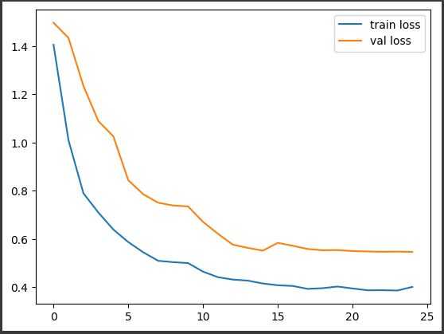
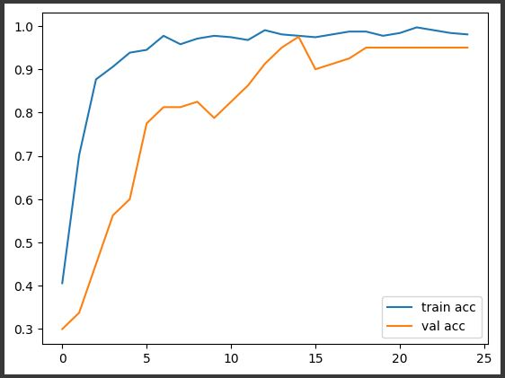

# Machine-Learning

### Models

Transfer learning and model fusion is used in this work. There are 3 fusioned model :

- DenseNet121
- InceptionV3
- VGG16

For an immediate simulation without the hassle of going over the previous instructions, refer to this link:

[Models TDCNN.h5](https://drive.google.com/file/d/1HgTgnThtP547ULdUKICEWDB_1BvJTJGN/view?usp=sharing)

`Models TDCNN File Size: (344 MB)`

### How To Use

1. Open the `Data_moisture.ipynb` file in `model/Data_moisture.ipynb`.
2. Import all the required libraries.
3. Build the model of `DenseNet121`, `InceptionV3`, and `VGG16`.
4. Fuse the previous three model into one model and make sure when all this three is fused.
5. Download the dataset from the link and load it into `ImageDataGenerator`.
6. Start the training.
7. You can see the accuracy and the train loss of our model.
8. And you can see the graph of it

### Results

Fig 1 Graph of Train Loss

Fig 2 Graph of Accuracy

